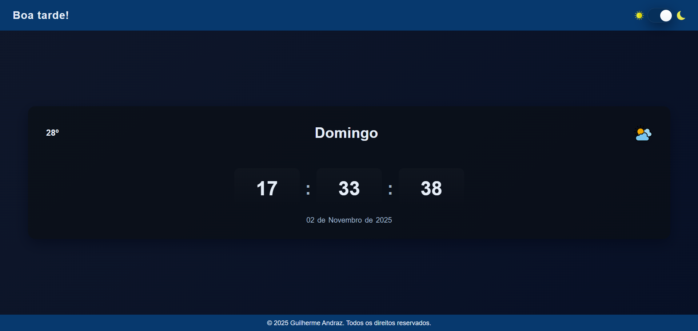

# Site de Relógio Digital Responsivo

Um relógio digital elegante, responsivo e com tema claro/escuro — 100% feito em HTML, CSS e JavaScript. Projeto minimalista com atualização de hora em tempo real, saudação dinâmica e visual fluido para dispositivos móveis e desktops.

## 📌 Descrição

Este projeto exibe um relógio digital com data, saudação dinâmica (Bom dia / Boa tarde / Boa noite), indicador de temperatura ilustrativo (ícone + valor) e alternância entre modo claro e modo escuro. Foi desenvolvido como um exemplo prático de layout responsivo (mobile-first), transições suaves e boas práticas de front-end sem dependências externas.

- Tecnologias: HTML5, CSS3 e JavaScript (ES6).
- Público-alvo: desenvolvedores aprendendo responsividade, temas dinâmicos e manipulação do DOM.

Frase curta: Design minimalista, acessível e pronto para mobile — leve e direto ao ponto.

## 🎯 Demonstração visual

Insira aqui uma captura de tela ou GIF do relógio funcionando:

```markdown

```


## ✨ Funcionalidades Principais

- Exibição da hora em tempo real (atualizada a cada segundo via JavaScript).
- Saudação dinâmica que muda conforme o horário (Bom dia, Boa tarde, Boa noite).
- Exibição do dia da semana e data completa (dia, mês por extenso e ano).
- Indicação de temperatura ilustrativa com ícone (troca de ícone conforme período do dia).
- Alternância entre modo claro e escuro com animação suave de transição (overlay sliding).
- Interface centralizada, minimalista e com sombras sutis.
- Design responsivo (Mobile First): adapta-se automaticamente a celulares, tablets, notebooks e telas ultrawide.

## 🧰 Tecnologias Utilizadas

- HTML5 — estrutura semântica do conteúdo.
- CSS3 — tipografia, layout responsivo, variáveis de tema (CSS custom properties), transições e sombras.
- JavaScript (ES6) — lógica do relógio, atualização em tempo real, gerenciamento de tema (persistência em localStorage) e manipulação do DOM.
- Google Fonts (Inter) — tipografia leve e legível.

## 📁 Estrutura do Projeto

Exemplo de estrutura (adaptada do projeto atual):

```
/relogio-digital
├── index.html
├── CSS/
│   └── style.css
├── SCRIPT/
│   └── script.js
├── ASSETS/
│   └── IMG/ (ícones e imagens usadas)
└── README.md
```

Breve papel de cada item:
- `index.html` — marcação e elementos do relógio (hora, minutos, segundos, saudação, toggle de tema).
- `CSS/style.css` — estilos mobile-first, variáveis de tema, media queries com `min-width` em `em`, regras para evitar overflow e tornar o layout fluido.
- `SCRIPT/script.js` — lógica de atualização do relógio, saudação dinâmica, seleção de ícones de clima, persistência do tema em `localStorage` e animação de transição.
- `ASSETS/IMG/` — imagens e ícones (sol, lua, clima etc.).

## ▶️ Como executar localmente

Siga estes passos simples:

1. Clone o repositório:

```bash
git clone https://github.com/usuario/relogio-digital.git
```

2. Acesse a pasta do projeto:

```bash
cd relogio-digital
```

3. Abra `index.html` em qualquer navegador moderno (Chrome, Edge, Firefox, Safari).

Não há dependências externas nem build — é um projeto front-end estático.

## 📱 Responsividade (Mobile First)

- O projeto foi desenvolvido orientado a Mobile First: estilos base consideram telas pequenas (até ~30em) e, em seguida, são aplicadas media queries com `min-width` em `em` para tablets (30em), desktops (48em) e telas extra-large (75em).
- Foram usadas unidades relativas (`rem`, `em`, `%`, `clamp()`) para manter proporções mesmo com zoom de usuário.
- Layout usa `flexbox` e `grid` para alinhamentos fluídos; `gap` é usado para espaçamento consistente.
- Todas as imagens/ícones têm `max-width:100%` e `height:auto` para evitar overflow horizontal.

## 🧩 Explicação do código (trechos comentados)

Abaixo há trechos representativos dos arquivos principais com comentários que explicam a função de cada parte.

### index.html (trecho)

```html
<!-- Toggle do tema no cabeçalho -->
<div class="toggle">
  
  <input type="checkbox" id="foo"> <!-- controle do tema -->
  <label for="foo"></label>
  
</div>
```

Comentários:
- O `input[type=checkbox]` controla o estado do tema (claro/escuro). A aparência é estilizada com CSS (label circular que desliza).
- As imagens do sol e da lua são apenas ícones de apoio visual.

### CSS/style.css (trecho)

```css
:root{ /* variáveis globais do tema */
  --bg-gradient: linear-gradient(...);
  --card-bg: rgba(255,255,255,0.85);
  --header-bg: rgb(80,157,239);
}

/* mobile-first: estilos base para telas pequenas */
.relogio{ width:96%; max-width:760px; padding:1.25rem; }

/* media queries com min-width (em) para aumentar conforme o tamanho da tela */
@media (min-width: 48em){
  .relogio{ padding:1.75rem 2rem; }
}
```

Comentários:
- Variáveis CSS facilitam a manutenção do tema e a alternância entre claro/escuro.
- O uso de `max-width`, `width:96%` e `clamp()` garante fluidez e que o layout mantenha proporções semelhantes nas várias resoluções.

### SCRIPT/script.js (trecho)

```javascript
function atualizarRelogio(){
  const agora = new Date();
  horasEl.textContent = pad(agora.getHours());
  minutosEl.textContent = pad(agora.getMinutes());
  segundosEl.textContent = pad(agora.getSeconds());
  // atualiza dia/mes/ano e saudação
}

function animateThemeToggle(targetIsDark){
  document.documentElement.style.setProperty('--overlay-color', overlayBg);
  document.body.classList.add('theme-animate');
  setTimeout(()=> applyTheme(targetIsDark), 350);
  setTimeout(()=>{ /* limpa classe de animação */ }, 1000);
}
```

Comentários:
- `atualizarRelogio()` atualiza o DOM com a hora atual a cada segundo (via `setInterval`).
- A função `animateThemeToggle` produz a transição visual entre temas usando um pseudo-elemento (`body::after`) que desliza, e então alterna a classe `dark` para aplicar as variáveis do tema escuro.

## 🚀 Possíveis melhorias futuras

- Integrar API de clima real (OpenWeather, Weatherbit) para exibir temperatura e condição real. 🌤️
- Permitir seleção manual de cores e temas customizados pelo usuário. 🎨
- Adicionar suporte multilíngue (PT/EN). 🌐
- Transformar em PWA (Progressive Web App) para instalação offline. 📲
- Implementar alarme, cronômetro e temporizador. ⏱️
- Melhorar Responsividade e layout
- Arrumar Bugs (Animação na troca de tema)

## 🧠 Aprendizados e conceitos aplicados

- Manipulação do DOM em tempo real com JavaScript (atualizar elementos, intervalos).
- Uso da API `Date()` para horário e data.
- Técnicas de responsividade Mobile First: unidades relativas, `clamp()`, `flexbox` e `grid`.
- Gerenciamento de preferências do usuário com `localStorage`.
- Boas práticas de acessibilidade mínima (atributos `alt`, `aria-label` adicionado via JS).

## 👤 Autor / Créditos

Desenvolvido por Guilherme Andraz.

- Direitos reservados © 2025 Guilherme Andraz.
- Perfil GitHub: ([adicione o link do seu perfil aqui](https://github.com/guiguix7))

## 📜 Licença

Projeto disponível para estudo e uso pessoal. Recomenda-se aplicar [MIT License](https://opensource.org/licenses/MIT) caso queira permitir uso amplo.

⭐ Se gostou deste projeto, não esqueça de deixar uma estrela no repositório!